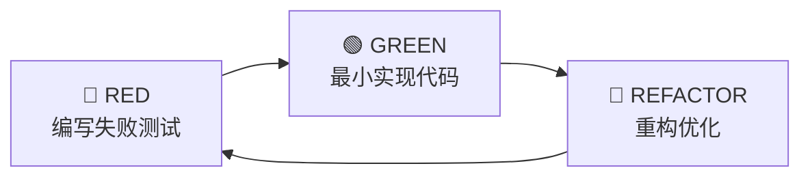

# CLAUDE.md — ScholarAgent 项目全局约束

> 本文件定义 ScholarAgent 项目的开发流程强制规则，覆盖所有 AI 辅助开发任务。
> 所有 subagent、worktree、技能调用均须遵守本文件约束。

---

## 1. TDD 强制规则（最高优先级）

所有代码开发子任务必须严格遵守 TDD（Test-Driven Development）循环：



### 1.1 禁止事项

- ❌ **禁止先生成业务代码后补充测试**
- ❌ 禁止在测试未通过时提交业务代码
- ❌ 禁止跳过测试编写直接进入实现阶段
- ❌ 禁止因"时间紧迫"跳过 RED 阶段

### 1.2 强制流程

每个代码开发子任务必须按以下顺序执行：

1. **RED 阶段**：编写该任务对应的失败测试用例
   - 覆盖正常输入、边界值、空值、异常参数、错误分支
   - 测试在实现代码不存在时应当**失败**
   - 运行 `pytest` 确认测试失败（红）
2. **GREEN 阶段**：编写最小实现代码使测试通过
   - 仅实现测试所覆盖的功能，不引入额外功能
   - 运行 `pytest` 确认全部测试通过（绿）
3. **REFACTOR 阶段**：在不破坏测试的前提下重构代码
   - 消除重复代码、提取公共函数、改善命名
   - 运行 `pytest` 确认测试仍全部通过

### 1.3 豁免条件

以下情况可 TDD 豁免，但必须在 AGENT_LOG 中标注豁免理由：

- 纯静态配置文件的创建或修改（`.env.example`、`requirements.txt` 等）
- 包初始化文件（`__init__.py`）
- 简单 UI 页面的骨架渲染（无业务逻辑的前端组件）
- 文档文件的创建和修改（`.md` 文件）

---

## 2. 技能调用规则

### 2.1 必须调用的技能

- 所有代码开发子任务必须调用 `/test-driven-development` 指令执行
- 所有 subagent 启动时优先产出测试用例，再产出实现代码
- 所有跨模块设计任务必须调用 `superpowers:brainstorming` 技能

### 2.2 技能优先级

1. `superpowers:brainstorming` — 设计决策前必须先 brainstorm
2. `superpowers:test-driven-development` — 开发子任务必须使用
3. `superpowers:subagent-driven-development` — 推荐的任务执行模式
4. `superpowers:finishing-a-development-branch` — 合并前必须使用

---

## 3. 测试规范

### 3.1 测试结构

```
tests/
├── __init__.py
├── conftest.py              # 全局 fixture（mock_llm, mock_llm_with_tool）
├── test_*.py                # 单元测试（按模块命名）
└── test_integration_*.py    # 集成测试（跨模块交互）
```

### 3.2 测试要求

- 每个业务模块必须有对应的测试文件
- 测试必须覆盖：正常输入、边界值、空值、异常参数、错误分支
- 测试必须使用 `MockLLM`，不依赖真实 LLM 调用
- 测试必须可独立运行，不依赖网络和外部服务
- 提交前必须运行 `make test` 或 `python -m pytest tests/ -v`，确认全部通过

---

## 4. 代码规范

### 4.1 通用约束

- Python 3.11+，TypeScript 严格模式
- 不使用第三方 Agent 框架（LangChain、AutoGen、CrewAI 等）
- 所有机制（守卫、校验器、反馈）必须是代码实现，非 prompt 实现
- API Key 不得硬编码在源代码中

### 4.2 提交规范

- 每个 task 独立提交，commit message 格式：`<type>: <description>`
- 类型：`feat` / `fix` / `docs` / `test` / `refactor` / `chore`
- 提交前必须运行完整测试套件，确保 0 失败

---

## 5. 项目上下文

- **项目**：ScholarAgent — 自动生成 IEEEtran 格式学术综述论文的 Agent
- **技术栈**：Python 3.11+ / FastAPI / React + TypeScript / SQLite
- **架构**：6 维度 Harness（决策封装、工具、记忆、治理、反馈、配置）
- **重点维度**：反馈闭环（Feedback Loop）— 5 个确定性校验器
- **测试策略**：Mock-LLM 驱动，不依赖真实 LLM，506 个测试全部通过

---

## 6. 参考文档

- `SPEC.md` — 项目规约
- `PLAN.md` — 实现计划（每个 Task 已含 TDD 验证步骤）
- `TDD_RECOVERY.md` — TDD 流程补证文档
- `AGENT_LOG.md` — 关键决策与流程偏离记录
- `REFLECTION.md` — 项目反思报告

---

*CLAUDE.md · 2026-08-13*